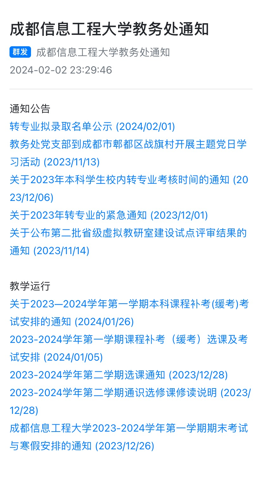

# CUIT-JWC

每日监测教务处新通知进行推送，利用`pushplus`实现推送功能

运行时间：北京时间`10:00 -- 18:00`  间隔1小时

使用方法：设置环境变量`token`和`topic`，修改工作流文件仓库路径

```git remote set-url origin https://x-access-token:${{ secrets.GITHUB_TOKEN }}@github.com/OWNER/REPO.git ```(你需要将`OWNER/REPO.git`替换为你的仓库的实际路径)




临时群发群组二维码（有效期30天）