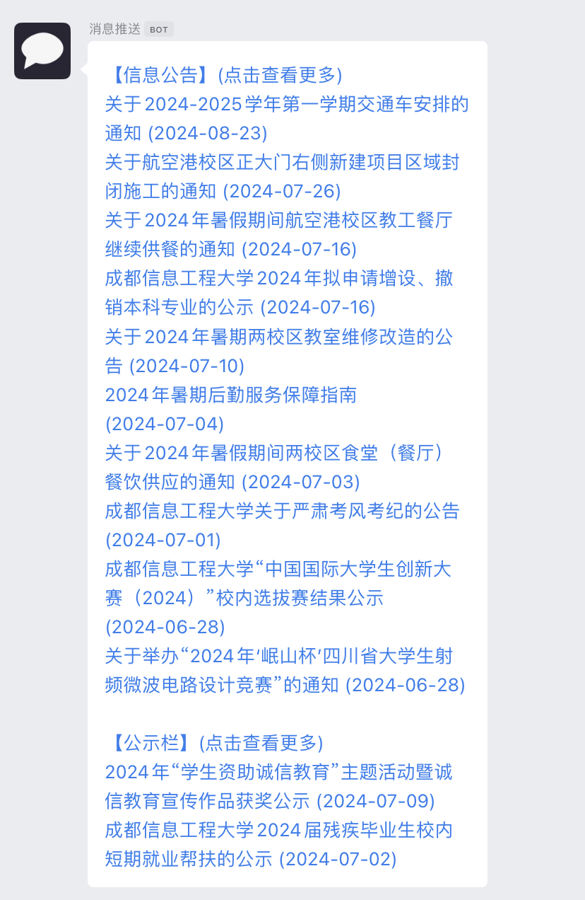

# 易通知

📣 易通知 - 成都信息工程大学每日更新推送

监测 <学校信息公告> <学生处公示栏> <教务处通知> 等新更新并进行推送，利用 `Pushplus` 、 `Server酱` 、 `企业微信BOT` 、 `微信企业会话群`实现推送功能。

## 使用

1. [克隆本仓库](https://github.com/yanyaoli/etz/fork)

2. 选择自己的分支仓库 -> `Settings` -> `Secrets and Variables` -> `Actions` -> `New repository secret`，按需添加以下内容：
   - **PUSHPLUS_TOKEN**：[Pushplus 官网](https://www.pushplus.plus/)免费申请
   - **PUSHPLUS_TOPIC**：如果需要群发，可以设置群组ID
   - **SERVERCHAN_SCKEY**：[Server酱官网](https://sct.ftqq.com/)免费申请
   - **WECOM_BOT_URL**：企业微信 bot 的 webhook URL
   - **WECHAT_BOT_URL**: 使用企业微信BOT推送到微信企业会话（不支持Markdown格式）

## Demo

  
  

